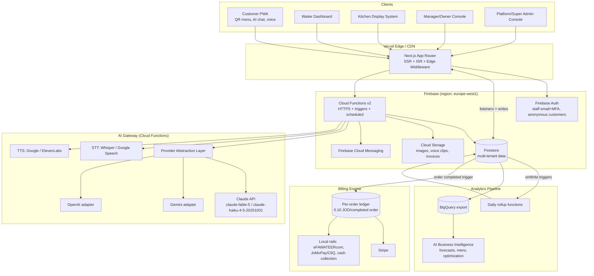
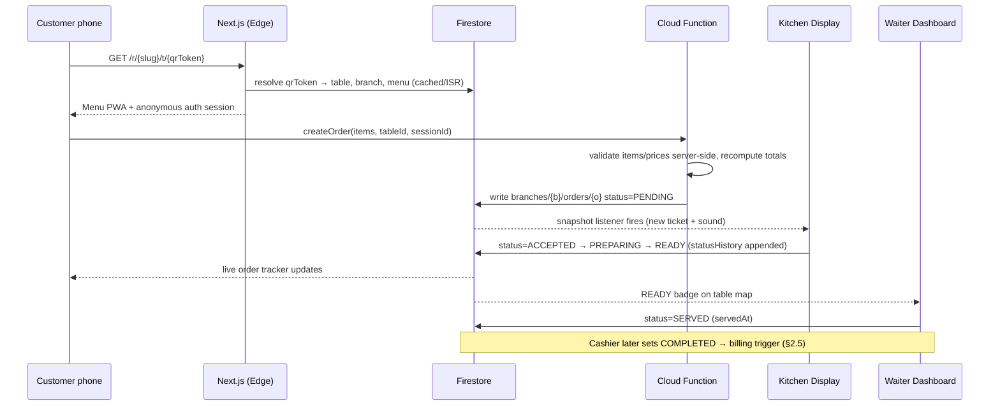
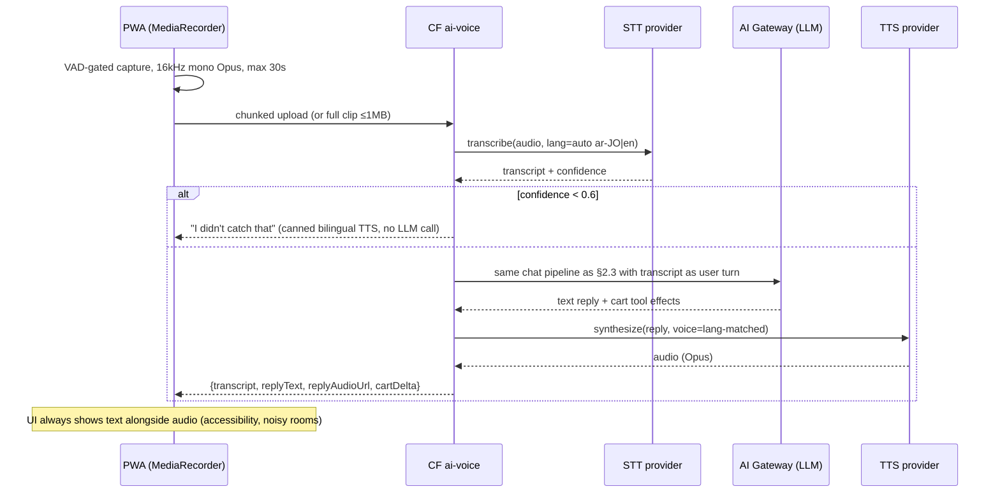

# Firefly X TalkTable — System Architecture

**Document:** 01-system-architecture.md
**Status:** Production specification (target platform)
**Phase 1 (shipped MVP):** Next.js 15 + TypeScript + Prisma + PostgreSQL (Neon) + Socket.io + JWT (Argon2) + Anthropic AI chat, deployed on Vercel.
**Target platform stack:** Next.js + TypeScript + TailwindCSS + Framer Motion (frontend); Firebase — Firestore, Cloud Functions, Auth, Storage (backend); AI provider abstraction (Claude primary, Gemini/OpenAI fallback); Stripe + local Jordanian payment rails.
**Business model:** No subscription. Restaurants pay **0.10 JOD per completed order**, free QR install/setup, automatic billing.

---

## 1. High-Level Architecture



### 1.1 Service Breakdown

| Service | Surface | Responsibility |
|---|---|---|
| **Customer PWA** | `/{restaurantSlug}/t/{qrToken}` | QR landing, bilingual menu, cart, AI chat ordering, voice ordering, waiter requests, bill view, feedback. Installable PWA, offline menu cache. No login (anonymous Firebase Auth session). |
| **Waiter Dashboard** | `/staff/waiter` | Live table map, open orders, waiter-request queue with SLA timers, mark served/resolved. |
| **Kitchen Display (KDS)** | `/staff/kitchen` | Ticket rail (PENDING→ACCEPTED→PREPARING→READY), item-level bump, prep-time tracking, sound alerts, all-day counts. |
| **Cashier Console** | `/staff/cashier` | Bill assembly per table, split bills, payment capture (cash/card/Stripe terminal), close order → triggers billing event. |
| **Branch Manager Console** | `/manage` | Menu CRUD, table/QR management, staff scheduling, inventory, knowledge base, branch analytics. |
| **Owner Console** | `/owner` | Multi-branch comparison, AI BI reports, CRM, billing/invoices, brand settings. |
| **AI Gateway** | Cloud Functions `ai-*` | Single entry point for all LLM/STT/TTS traffic. Provider abstraction, prompt assembly, tool execution (cart ops, menu lookup), token metering into `aiUsage`, guardrails. |
| **Realtime Layer** | Firestore listeners | Order/ request/ table state fan-out to all dashboards (see §4). |
| **Billing Engine** | Cloud Functions `billing-*` | Immutable per-order ledger entries (0.10 JOD), monthly invoice generation, Stripe charge + local-rail fallback, dunning, webhooks. |
| **Analytics Pipeline** | Scheduled functions + BigQuery | Hourly/daily rollups into `analytics`, raw export to BigQuery, feeds AI BI module. |
| **Admin Platform** | `/platform` | Restaurant onboarding, QR kit generation, health monitoring, AI usage & cost dashboards, feature flags, impersonation (audited). |

---

## 2. Data Flow Diagrams

### 2.1 QR Scan → Order → Kitchen → Served



### 2.2 Waiter Request

```
Customer taps "Call waiter / Bill / Water / Help"
  → CF createWaiterRequest (rate-limited: 1 open request per type per table)
  → Firestore waiterRequests doc status=OPEN
  → Waiter dashboards listening on (branchId, status==OPEN) get push + FCM
  → Waiter taps Acknowledge (status=ACKNOWLEDGED, ackAt) → customer sees "on the way"
  → Waiter taps Resolve (status=RESOLVED, resolvedAt)
  → Scheduled escalation fn: OPEN > maxTableWaitMinutes → notify branch manager
```

### 2.3 AI Chat Turn

```
Customer message ──► CF ai-chat (HTTPS callable, App Check enforced)
  1. Load context: menu snapshot (cached), knowledge base, table session, CRM prefs/allergies
  2. Assemble prompt: stable system prompt first (prompt-cache friendly),
     volatile context (cart, time) last
  3. ProviderRouter.complete({model: tier})
       primary: Claude claude-haiku-4-5-20251001 (chat) / claude-fable-5 (complex BI)
       on 429/5xx/timeout(8s): Gemini adapter → OpenAI adapter
  4. Tool loop: add_to_cart, remove_from_cart, get_item_details, call_waiter,
     check_allergens, get_order_status — executed server-side, results fed back
  5. Stream tokens to client (SSE); persist transcript to aiSessions
  6. Meter tokens → aiUsage/{restaurantId}/{yyyymm} (provider, model, in/out tokens, cost)
```

### 2.4 Voice Ordering Pipeline (mic → STT → LLM → TTS)



Latency budget: STT ≤1.5s, LLM first-token ≤1.2s (Haiku), TTS ≤1.0s; end-to-end target ≤4s p95.

### 2.5 Per-Order Billing Event

```
Order status → COMPLETED (cashier or auto-complete fn)
  → Firestore trigger onOrderCompleted
  → Idempotency: ledger doc ID = `chg_{orderId}` (create-only; duplicate trigger = no-op)
  → Write billing/{restaurantId}/ledger/chg_{orderId}:
      {orderId, branchId, amount: 0.100, currency: "JOD", type: "ORDER_FEE",
       orderTotal, occurredAt, invoiceId: null}
  → Cancelled/refunded order later → compensating CREDIT entry (never mutate/delete)
  → Monthly (1st, 02:00 Asia/Amman) invoice fn:
      sum un-invoiced ledger entries per restaurant → invoices/{id} (PDF to Storage)
      → charge saved Stripe payment method (JOD via USD conversion or local rail)
      → webhook confirms → invoice status=PAID; failure → dunning (3 retries / 10 days)
      → persistent failure → restaurant flagged PAST_DUE → platform admin alert
```

---

## 3. Multi-Branch Tenancy Model

```
restaurants/{restaurantId}                 ← tenant root (brand, billing, owner)
  /branches/{branchId}                     ← physical location (timezone, hours, settings)
    /tables/{tableId}                      ← QR token, capacity, zone
    /orders/{orderId}                      ← order + embedded items
  menus, menuItems, categories             ← restaurant-scoped, branch overrides
                                             (availability/price per branch via
                                              branchOverrides map on menuItem)
customers/{customerId}                     ← platform-level CRM identity (phone-keyed),
  /visits/{visitId}                          per-restaurant profile subdocs
```

**Tenancy rules**

- Every staff user has custom claims: `{role, restaurantId, branchIds[]}`. Security rules enforce that all reads/writes are scoped to the claimed `restaurantId` and (for branch roles) `branchIds`.
- Owner sees all branches; Branch Manager only assigned branches; Waiter/Kitchen/Cashier only their active branch.
- Platform Admin / Super Admin bypass tenant scoping via dedicated claims, with every cross-tenant read written to `auditLogs`.
- Menu data is restaurant-level with per-branch override maps to avoid N× menu duplication; the menu snapshot served to the PWA is materialized per branch into a single cached document (`branches/{b}/menuSnapshot`) regenerated by trigger on menu writes.

---

## 4. Realtime Architecture

### 4.1 Firestore Listeners vs Socket.io

| Criterion | Socket.io (Phase 1 MVP) | Firestore listeners (target) |
|---|---|---|
| Server | Custom Node server (does not fit Vercel serverless; MVP runs a separate listener path) | Fully managed, no server |
| Delivery | At-most-once unless custom acks built | Snapshot consistency; client always converges to current state |
| Reconnect/offline | Manual buffering | Built-in local cache, automatic resume |
| Auth | Custom JWT handshake | Same Firebase Auth token + security rules |
| Latency | ~50–150ms | ~150–400ms (acceptable for restaurant ops) |
| Cost | VM/container cost, fixed | Per-read; dominated by dashboard listeners — bounded by query limits |
| Fan-out logic | Rooms managed in code | Declarative queries (`where status in [...]`) |
| Multi-region scale | Sticky sessions / Redis adapter needed | Automatic |

**Decision: Firestore snapshot listeners are the realtime layer for the target platform.** Rationale: state-convergent delivery (a kitchen screen that was offline for 30s must show the *current* ticket set, not a replayed event stream), zero realtime infrastructure to operate, and security rules apply uniformly. Socket.io is retired at cutover (see doc 03 migration strategy). FCM supplements listeners for backgrounded devices (waiter phones).

**Listener discipline (cost control):**
- Dashboards subscribe to bounded queries only: `orders where status in [PENDING..READY] and branchId == X`, limit 100.
- Historical views use one-shot paginated `get()`, never listeners.
- Customer PWA listens to exactly one order doc + one waiterRequest doc.
- Aggregates (today's revenue tickers) read from rollup docs updated by triggers, not raw order scans.

### 4.2 Realtime Event Catalog
The canonical event list (doc shape per event) lives in `04-api-structure.md` §9. Events are *derived from document writes* — there is no separate event bus; "event name" = (collection, transition).

---

## 5. AI Provider Abstraction Layer

All model traffic flows through one interface; no UI or business code imports a provider SDK directly.

```typescript
// packages/ai/provider.ts
export type AITier = "chat" | "complex" | "embedding";

export interface AIMessage { role: "system" | "user" | "assistant" | "tool"; content: string | ToolResult[]; }
export interface AIToolDef { name: string; description: string; inputSchema: JSONSchema; }

export interface CompletionRequest {
  tier: AITier;                    // router maps tier → provider+model
  messages: AIMessage[];
  tools?: AIToolDef[];
  maxTokens: number;
  stream?: boolean;
  metadata: { restaurantId: string; branchId?: string; sessionId: string; feature: "chat"|"voice"|"bi"|"insights" };
}

export interface CompletionResult {
  text: string;
  toolCalls: { name: string; input: unknown; id: string }[];
  usage: { inputTokens: number; outputTokens: number; cacheReadTokens?: number };
  provider: "anthropic" | "google" | "openai";
  model: string;
  latencyMs: number;
}

export interface AIProvider {
  readonly name: string;
  complete(req: CompletionRequest): Promise<CompletionResult>;
  completeStream(req: CompletionRequest): AsyncIterable<StreamChunk>;
  healthy(): boolean; // circuit-breaker state
}
```

**Routing table:**

| Tier | Primary | Fallback 1 | Fallback 2 |
|---|---|---|---|
| `chat` (customer ordering, voice) | Anthropic `claude-haiku-4-5-20251001` | Gemini Flash | OpenAI mini-tier |
| `complex` (BI reports, forecasting narratives, menu optimization) | Anthropic `claude-fable-5` | Anthropic `claude-haiku-4-5-20251001` (degraded) | Gemini Pro |
| `embedding` (knowledge-base retrieval) | OpenAI embeddings | Gemini embeddings | — |

**Adapter rules:**
- Each adapter translates the neutral message/tool format to the provider wire format (Anthropic Messages API via `@anthropic-ai/sdk`; Gemini via `@google/generative-ai`; OpenAI via `openai`).
- **Failover policy:** retry primary once on 429/5xx with jittered backoff, then fail over. Circuit breaker opens after 5 failures/60s per provider, half-opens after 30s.
- **Prompt-cache friendliness (Anthropic):** stable system prompt + tool definitions first with `cache_control: {type: "ephemeral"}`; per-request context (cart, table) appended last.
- Tool-call loops are executed in the gateway, never the client; max 6 tool iterations per turn.
- Every call writes an `aiUsage` ledger row (provider, model, tokens, computed cost, feature, restaurantId) — feeds platform-admin cost dashboards and per-restaurant fair-use throttling.
- Provider/model per tier is a remote-config value — switchable without deploy.

---

## 6. Caching, CDN, Edge Strategy

| Layer | What | Strategy |
|---|---|---|
| Vercel CDN | Static assets, menu item images (via `next/image` → Cloud Storage origin) | Immutable, content-hashed, 1y TTL |
| ISR | Public menu page per branch | `revalidate: 300` + on-demand revalidation webhook fired by menu-write trigger |
| Edge middleware | QR token → branch resolution | Edge KV cache 60s (token→branchId map), avoids Firestore read on every scan |
| Firestore | `branches/{b}/menuSnapshot` materialized doc | One read serves whole menu; client persists in IndexedDB (offline menu) |
| Cloud Functions | Menu/knowledge context for AI gateway | In-instance LRU, 60s TTL, keyed by branchId+menuVersion |
| Anthropic prompt cache | System prompt + tools + menu snapshot | `cache_control` breakpoints; ~90% input-token savings on multi-turn chats |
| Client (PWA) | Menu, images, last order state | Service worker: stale-while-revalidate menu, cache-first images |

---

## 7. Scaling Plan

### 7.1 — 1 restaurant (launch)
- Single Firebase project, single region (`europe-west1`), Firestore default capacity.
- All Cloud Functions min-instances = 0 except `ai-chat` (min 1, kills cold-start latency).
- Costs ≈ free tier + AI tokens. No BigQuery yet; rollups in Firestore only.

### 7.2 — 100 restaurants
- ~100–300 branches, ~5k orders/day, ~50k Firestore writes/day — well inside single-DB limits.
- Enable BigQuery streaming export (orders, aiUsage) for BI.
- `ai-chat` min instances 2; add per-restaurant AI rate limits (token budget/day, soft-throttle to Haiku-only).
- Composite-index review; alerting on listener-read spend per restaurant.
- Stripe Billing automation hardened: dunning, PAST_DUE suspension flow.
- On-call rota + status page.

### 7.3 — 10,000 restaurants
- ~50k orders/hour peak. Key Firestore limits: 1 write/sec/document (sustained) and hotspotting on monotonic doc IDs.
  - Mitigations: random doc IDs (already default), per-branch counters use **distributed shard counters** (10 shards per hot counter), rollups batched.
- Split Firebase projects by region/market if data-residency demands (project-per-region; routing layer maps restaurant → project).
- AI gateway: move to dedicated Cloud Run service (concurrency 80, autoscale), provider quota contracts (Anthropic priority tier), per-tenant token buckets, response caching for identical FAQ-type queries (normalized-prompt hash, 10-min TTL).
- Analytics fully on BigQuery + scheduled queries; Firestore keeps only serving rollups.
- Billing: ledger writes are append-only and shard naturally by restaurant; invoice generation fans out via Cloud Tasks queue (rate-limited, retryable).
- Multi-CDN images, image resize pipeline (Storage trigger → variants).
- SLOs: order write→KDS render p95 < 1.5s; AI first token p95 < 1.5s; platform availability 99.9%.

---

## 8. Cross-Cutting Concerns

- **Observability:** Cloud Logging structured logs (every log line carries `restaurantId`, `branchId`, `requestId`), Cloud Monitoring dashboards, Sentry on all clients, AI-gateway latency/cost metrics per provider.
- **Idempotency:** all money- and order-mutating functions accept/derive an idempotency key (doc-ID-as-key pattern).
- **Time:** all timestamps UTC (`Timestamp`); rendering localized to branch timezone (`Asia/Amman` default).
- **i18n:** all user-facing strings AR/EN; data model carries `name`/`nameAr` pairs end-to-end (see doc 02).
- **Security:** see `05-security-architecture.md`.
